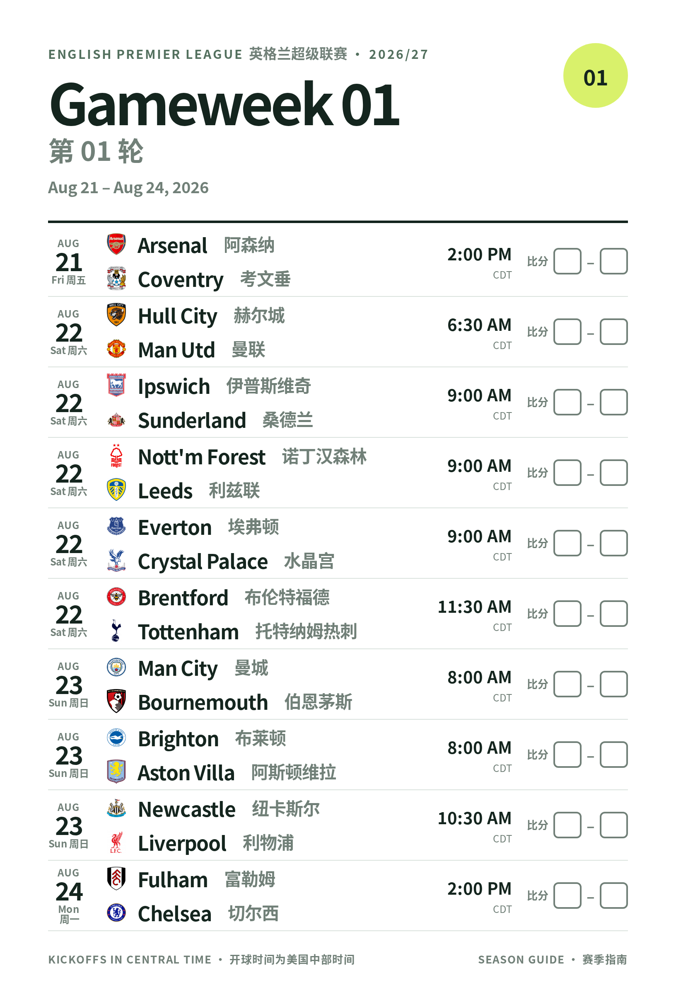

# premier league schedule to pdf

i vibe coded this for my gramps



## make it

```bash
python3 generate_schedule.py schedule.json --output schedule.html
node render_pdf.cjs schedule.html schedule.pdf   # print-exact pdf
```

## fresh fixtures

the data comes from [openfootball](https://github.com/openfootball/england).
kickoff times are only real for the first ~9 week.

```bash
curl -sO https://raw.githubusercontent.com/openfootball/england/master/2026-27/1-premierleague.txt
python3 import_fixtures.py 1-premierleague.txt --season 2026/27 -o schedule.json
```

crests are from [luukhopman/football-logos](https://github.com/luukhopman/football-logos).
